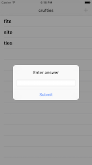

# WordScramble
Repo following the Word Scramble tutorial on www.hackingwithswift.com



## Concepts Learned/Practiced
* Closure structure
  * Trailing closure syntax
  * Example from this project:
  ```
  let submitAction = UIAlertAction(title: "Submit", style: .Default) { [unowned self, ac] _ in
            let answer  = ac.textFields![0]
            self.submitAnswer(answer.text!)
        }
  ```
* Returning values from functions/methods
  * Use ```->``` to specify a return value and then specify the data type returned: ```Bool```, ```String```, etc.
  * Use keyword ```return``` in body of function to return the value from the function.
  * Example from this project:
  ```
  func wordIsOriginal(word: String) -> Bool {
         return !objects.contains(word)
     }
  ```
* ```UITableView```
  * Reloading data
  * How to insert rows
* Adding text fields to ```UIAlertController``` to accept user input
* ```NSRange```

## Attributions
* [Project 5: Word Scramble @ hackingwithswift.com](https://www.hackingwithswift.com/read/5/overview)
